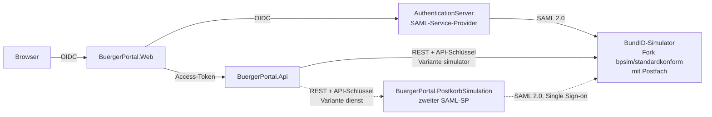

# BürgerPortal mit BundID-Anmeldung (Studienprojekt)

Bürgerportal einer Stadt (Termine, Reisepass- und Sperrmüll-Anträge, Mängelmeldungen), bei dem die Anmeldung
**ausschließlich über die BundID** erfolgt – hier über einen erweiterten **BundID-Simulator** der Bundesagentur für
Arbeit. Bestätigungen landen in einem simulierten **BundID-Postfach** (Zentrales Bürgerpostfach), das – wie bei der
echten BundID – Teil des BundID-Auftritts ist. Für das Postfach gibt es zwei umschaltbare Varianten (siehe unten).
Branch `feature/bundidsimulator`; jeder Umbau-Schritt ist ein eigener, begründeter Commit.

## Architektur



Öffentlich (Betrieb): Portal `https://<domain>`, Auth-Server `https://auth.<domain>`, BundID-Simulator
`https://bundid.<domain>` und darunter das Postfach `https://bundid.<domain>/postfach/`.

| Projekt | Aufgabe |
|---|---|
| `AuthenticationServer` | ASP.NET Identity + OpenIddict; meldet Personen per SAML 2.0 bei der BundID an (`prompt=login` → `ForceAuthn`), legt Konten per bPK2 an, stellt OIDC-Tokens aus (Vertrauensniveau als `acr`, Postkorb-Handle, Refresh-Token) |
| `BuergerPortal.Web` | Oberfläche und installierbare App (PWA); ohne Anmeldung nur die Einstiegsseite; „Meine Daten“, Step-up auf Niveau „substanziell“; Sitzungsdaten serverseitig |
| `BuergerPortal.Api` | Fachlogik (Terminprüfung je Standort, Feiertage); Policy für Vertrauensniveau; sendet Bestätigungen an das Postfach und Benachrichtigungen per Web Push |
| `BuergerPortal.PostkorbSimulation` | Postfach-Variante „dienst“: REST nach ZBP `CreateMessage`; Oberfläche meldet sich als eigener SAML-SP über die bestehende BundID-Sitzung an, ohne `ForceAuthn` |
| `BuergerPortal.BundId` / `.Core` | gemeinsamer SAML-Ablauf (ITfoxtec.Identity.Saml2) bzw. Claim-Namen und Vertrauensniveaus |
| `BuergerPortal.Tests` | xUnit: SAML-Prüfungen und Angriffsfälle, Kontoanlage, Policies, Postkorb, Sitzung, Terminprüfung, Web Push (RFC-8291-Beispiel) |

## BundID-Postfach: zwei Varianten

| Variante (`BPSIM_POSTFACH`) | Wo das Postfach liegt | Anmeldung |
|---|---|---|
| `simulator` (Standard) | im BundID-Simulator (Fork), Teil des simulierten BundID-Kontos | Anmeldesitzung der BundID direkt, kein SAML dazwischen |
| `dienst` | eigener Dienst `BuergerPortal.PostkorbSimulation` unter derselben Adresse | als zweiter SAML-Dienstanbieter mit Single Sign-on |

Beide nehmen Nachrichten gleich an (`POST /api/v1/messages`, Header `X-Api-Key`), beide haben „Zurück zum BürgerPortal“.
Umschalten im Betrieb: `deploy/postfach-modus.ps1 -Modus simulator|dienst` (Nachrichten bleiben im jeweiligen Postfach).

## Sitzung

30 Minuten ohne Aktivität oder spätestens 8 Stunden nach der Anmeldung endet die Sitzung; zwei Minuten vorher warnt
die Seite („Angemeldet bleiben“). Das Access-Token wird solange per Refresh-Token erneuert. Die Sitzungsdaten liegen
verschlüsselt auf dem Server, das Cookie enthält nur eine Kennung. Jede Anmeldung ist eine neue BundID-Anmeldung.

## Sicherheit

| Was | Wie | Einstellung |
|---|---|---|
| Content-Security-Policy | Portal: Nonce je Anfrage (`Services/ContentSecurityPolicy.cs`, Tag-Helper an jedem `<script>`); Auth-Server und Simulator: Caddy, mit dem Hash der festen Auto-POST-Skripte von ITfoxtec (SAMLRequest) und OpenIddict (`form_post`) | `BPSIM_CSP_HEADER` = `Content-Security-Policy` (Standard) bzw. `…-Report-Only` (nur melden); im Web `Csp:Header` |
| Permissions-Policy | Caddy: Standort und Kamera nur im Portal | `deploy/Caddyfile` |
| Rate-Limiting | Auth-Server je Client-IP und Minute: `/bundid/login` + `/bundid/acs` 30, `/connect/*` 60, Token/UserInfo 300; API je Person 10 Buchungen/Stornos/Umbuchungen | `RateLimiting:Saml`, `:Oidc`, `:Backchannel` (Auth), `RateLimiting:BuchungenProMinute` (API) |
| Doppelbuchungen | Prüfen und Speichern in einer Transaktion unter `sp_getapplock` je Person und Standort | – |
| Diagnose-Adressen | `/auth/debug`, `/home/testuser` (Web), `api/debug/*`, `api/email/test` (API) nur in `Development` | `Diagnostics:Enabled=true` schaltet sie auch sonst ein |
| Push-Abos | nur `https` zu bekannten Push-Diensten (Schutz vor Server-Side Request Forgery), Schlüssel als Punkt auf P-256 geprüft, nur eigene Abos änderbar, Antiforgery-Token im Portal, 10 Anfragen je Minute und Person | `Push:AllowedHosts` (leer = Google, Microsoft, Mozilla, Apple) |

## App (PWA) und Benachrichtigungen

- **Installieren:** ein Dialog „App installieren“ mit Anleitung je Gerät (Android, iPhone/iPad, Computer) und QR-Code
  (`/app/qr.svg`); Manifest mit Kurzbefehlen, Screenshots und maskierbarem Icon; Hinweisleisten „Neue Version“ und
  „Offline“. Der Service Worker (`wwwroot/sw.js`) speichert nur statische Dateien, keine Seiten.
- **Benachrichtigungen (Web Push):** Einstellungen → Benachrichtigungen. Bei einer neuen Postfach-Nachricht schickt die API
  Titel, Betreff und Ziel (`/Postfach`) an jedes Gerät der Person – verschlüsselt nach **RFC 8291** (aes128gcm), der
  Server weist sich per **VAPID** aus (RFC 8292); beides mit Bordmitteln von .NET (`BuergerPortal.Api/Push/`). Ablauf:
  Browser → `/push/subscriptions` (Portal, Antiforgery) → `api/push/subscriptions` (API, Tabelle `PushSubscriptions`);
  Postfach zugestellt → Warteschlange → Push-Dienst des Browsers → Service Worker zeigt an, Punkt am App-Symbol.
  iPhone/iPad: nur als installierte App ab iOS 16.4.
- **Schlüssel:** `Push:VapidPublicKey`, `Push:VapidPrivateKey` (P-256, base64url), `Push:Subject` (Kontakt). Ohne
  Schlüssel ist Push aus. Im Betrieb erzeugt `deploy/deploy.ps1` das Paar einmalig in der `.env`
  (`BPSIM_VAPID_PUBLIC_KEY`, `BPSIM_VAPID_PRIVATE_KEY`); danach nicht mehr ändern, sonst werden alle Abos ungültig.

## Lokal starten (Entwicklung)

Voraussetzungen: .NET SDK 10 (siehe `global.json`; alle Projekte zielen auf `net10.0`, LTS), SQL Server LocalDB, Docker.

1. **BundID-Simulator** (Fork) bauen und starten:
   ```
   docker build -t buergerportal/bundid-simulator:dev https://github.com/DrFisch/bundid-simulator.git#bpsim/standardkonform
   docker compose -f compose.bundid-dev.yml up -d        # http://localhost:8090/saml/metadata, Postfach /postfach
   ```
2. **Datenbanken** anlegen (einmalig bzw. nach neuen Migrationen), jeweils aus dem Repo-Wurzelverzeichnis:
   ```
   dotnet ef database update --project AuthenticationServer
   dotnet ef database update --project BuergerPortal.Infrastructure --startup-project BuergerPortal.Api
   dotnet ef database update --project BuergerPortal.PostkorbSimulation
   ```
   Im Container übernehmen das die Dienste beim Start (`Database:MigrateOnStartup=true`).
3. **Dienste starten** (je ein Terminal, Profil `https`): Auth-Server https://localhost:7001, Web https://localhost:7002,
   API https://localhost:7003, Postfach-Dienst https://localhost:7005. Standard lokal ist die Variante „dienst“; für
   das Postfach im Simulator API und Web mit `Postkorb__BaseUrl=http://localhost:8090/`,
   `Postkorb__ApiKey=<APP_POSTFACH_APIKEY aus compose.bundid-dev.yml>`, `Postkorb__PostfachUrl=http://localhost:8090/postfach`
   und `Postkorb__Variante=simulator` starten. Für Benachrichtigungen die API zusätzlich mit `Push__VapidPublicKey`,
   `Push__VapidPrivateKey` und `Push__Subject` starten (Schlüsselpaar z. B. mit `Vapid.GenerateKeys()`).
4. https://localhost:7002 öffnen → „Mit BundID anmelden“ → im Simulator eine Testperson wählen
   (Identifizierungsmittel „Benutzername“ = Niveau normal, „Elster“ = substanziell, „eID“ = hoch).

Tests: `dotnet test BuergerPortal.Tests`.

## Betrieb (Container)

Alles läuft in Containern auf einer VM, auch SQL Server; nur Caddy (HTTPS) ist von außen erreichbar.

| Datei | Zweck |
|---|---|
| `Dockerfile.auth`, `.api`, `.portal`, `.postkorb` | Images (Multi-Stage, Nicht-root, ohne lokale Einstellungen) |
| `deploy/compose.prod.yml` | alle Dienste mit Limits, Volumes, Healthcheck; Konfiguration nur aus `.env` (u. a. `BPSIM_POSTFACH`) |
| `deploy/Caddyfile` | Hosts, automatisches TLS, Postfach unter `bundid.<domain>/postfach` (Ziel je Variante), Simulator-Actuator und Einlieferungs-REST von außen gesperrt |
| `deploy/.env.example` | alle benötigten Werte (die echte `.env` gehört nie ins Repository) |
| `deploy/compose.local.yml` | lokaler Test des Betriebs unter `https://bpsimulation.localhost` (Ablauf im Dateikopf) |
| `deploy/*.ps1` | `gcp-setup`, `deploy`, `vm-start`/`-stop`/`-status`, `logs`, `db-backup`, `destroy`, `dns` (nur `bpsimulation`-Einträge), `postfach-modus` |

Die Skripte lesen ihre Einstellungen aus einer Datei außerhalb des Repositorys (Pfad in `BPSIM_DEPLOY_CONFIG`) und
fragen vor jedem kostenpflichtigen Schritt nach.

## Hinweise

- Simulation mit fiktiven Testpersonen – keine Anbindung an die echte BundID und kein echtes BundID-Postfach.
- Der BundID-Simulator ist ein **Fork** des Simulators der Bundesagentur für Arbeit
  (https://github.com/ba-itsys/bundid-simulator): signierte Assertions, IdP-Metadaten, eIDAS-LoA-URIs und das Attribut
  Postkorb-Handle wurden ergänzt, damit eine SAML-Bibliothek mit voller Prüfung arbeiten kann; dazu eine
  Anmeldesitzung (Single Sign-on, `ForceAuthn` wird beachtet) und ein Postfach im simulierten Konto. Details im Fork
  unter `FORK.md`.
