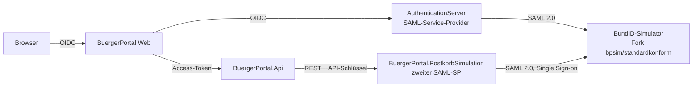

# BürgerPortal mit BundID-Anmeldung (Studienprojekt)

Bürgerportal einer Stadt (Termine, Reisepass- und Sperrmüll-Anträge, Mängelmeldungen), bei dem die Anmeldung
**ausschließlich über die BundID** erfolgt – hier über einen erweiterten **BundID-Simulator** der Bundesagentur für
Arbeit. Bestätigungen landen in einem simulierten **BundID-Postfach** (Zentrales Bürgerpostfach), das – wie bei der
echten BundID – Teil des BundID-Auftritts ist und die BundID-Anmeldesitzung mitnutzt.
Branch `feature/bundidsimulator`; jeder Umbau-Schritt ist ein eigener, begründeter Commit.

## Architektur



Öffentlich (Betrieb): Portal `https://<domain>`, Auth-Server `https://auth.<domain>`, BundID-Simulator
`https://bundid.<domain>` und darunter das Postfach `https://bundid.<domain>/postfach`.

| Projekt | Aufgabe |
|---|---|
| `AuthenticationServer` | ASP.NET Identity + OpenIddict; meldet Personen per SAML 2.0 bei der BundID an, legt Konten per bPK2 an, stellt OIDC-Tokens aus (Vertrauensniveau als `acr`, Postkorb-Handle) |
| `BuergerPortal.Web` | Oberfläche; ohne Anmeldung nur die Einstiegsseite; „Meine Daten“, Step-up auf Niveau „substanziell“ |
| `BuergerPortal.Api` | Fachlogik; Policy für Vertrauensniveau; sendet Bestätigungen an das Postfach |
| `BuergerPortal.PostkorbSimulation` | simuliertes BundID-Postfach (REST nach ZBP `CreateMessage`; Oberfläche meldet sich als eigener SAML-SP über die bestehende BundID-Sitzung an, ohne `ForceAuthn`) |
| `BuergerPortal.BundId` / `.Core` | gemeinsamer SAML-Ablauf (ITfoxtec.Identity.Saml2) bzw. Claim-Namen und Vertrauensniveaus |
| `BuergerPortal.Tests` | xUnit: SAML-Prüfungen und Angriffsfälle, Kontoanlage, Policies, Postkorb |

## Lokal starten (Entwicklung)

Voraussetzungen: .NET SDK 9, SQL Server LocalDB, Docker.

1. **BundID-Simulator** (Fork) bauen und starten:
   ```
   docker build -t buergerportal/bundid-simulator:dev https://github.com/DrFisch/bundid-simulator.git#bpsim/standardkonform
   docker compose -f compose.bundid-dev.yml up -d        # http://localhost:8090/saml/metadata
   ```
2. **Datenbanken** anlegen (einmalig bzw. nach neuen Migrationen), jeweils aus dem Repo-Wurzelverzeichnis:
   ```
   dotnet ef database update --project AuthenticationServer
   dotnet ef database update --project BuergerPortal.Infrastructure --startup-project BuergerPortal.Api
   dotnet ef database update --project BuergerPortal.PostkorbSimulation
   ```
   Im Container übernehmen das die Dienste beim Start (`Database:MigrateOnStartup=true`).
3. **Dienste starten** (je ein Terminal, Profil `https`): Auth-Server https://localhost:7001, Web https://localhost:7002,
   API https://localhost:7003, Postkorb https://localhost:7005.
4. https://localhost:7002 öffnen → „Mit BundID anmelden“ → im Simulator eine Testperson wählen
   (Identifizierungsmittel „Benutzername“ = Niveau normal, „Elster“ = substanziell, „eID“ = hoch).
   „Mein BundID-Postfach“ öffnet danach das Postfach ohne erneute Auswahl (Anmeldesitzung des Simulators).

Tests: `dotnet test BuergerPortal.Tests`.

## Betrieb (Container)

Alles läuft in Containern auf einer VM, auch SQL Server; nur Caddy (HTTPS) ist von außen erreichbar.

| Datei | Zweck |
|---|---|
| `Dockerfile.auth`, `.api`, `.portal`, `.postkorb` | Images (Multi-Stage, Nicht-root, ohne lokale Einstellungen) |
| `deploy/compose.prod.yml` | alle Dienste mit Limits, Volumes, Healthcheck; Konfiguration nur aus `.env` |
| `deploy/Caddyfile` | Hosts, automatisches TLS, Postfach unter `bundid.<domain>/postfach`, Simulator-Actuator und Postkorb-REST von außen gesperrt |
| `deploy/.env.example` | alle benötigten Werte (die echte `.env` gehört nie ins Repository) |
| `deploy/compose.local.yml` | lokaler Test des Betriebs unter `https://bpsimulation.localhost` (Ablauf im Dateikopf) |
| `deploy/*.ps1` | `gcp-setup`, `deploy`, `vm-start`/`-stop`/`-status`, `logs`, `db-backup`, `destroy`, `dns` (nur `bpsimulation`-Einträge) |

Die Skripte lesen ihre Einstellungen aus einer Datei außerhalb des Repositorys (Pfad in `BPSIM_DEPLOY_CONFIG`) und
fragen vor jedem kostenpflichtigen Schritt nach.

## Hinweise

- Simulation mit fiktiven Testpersonen – keine Anbindung an die echte BundID und kein echtes BundID-Postfach.
- Der BundID-Simulator ist ein **Fork** des Simulators der Bundesagentur für Arbeit
  (https://github.com/ba-itsys/bundid-simulator): signierte Assertions, IdP-Metadaten, eIDAS-LoA-URIs und das Attribut
  Postkorb-Handle wurden ergänzt, damit eine SAML-Bibliothek mit voller Prüfung arbeiten kann; dazu eine
  Anmeldesitzung (Single Sign-on, `ForceAuthn` wird beachtet). Details im Fork unter `FORK.md`.
